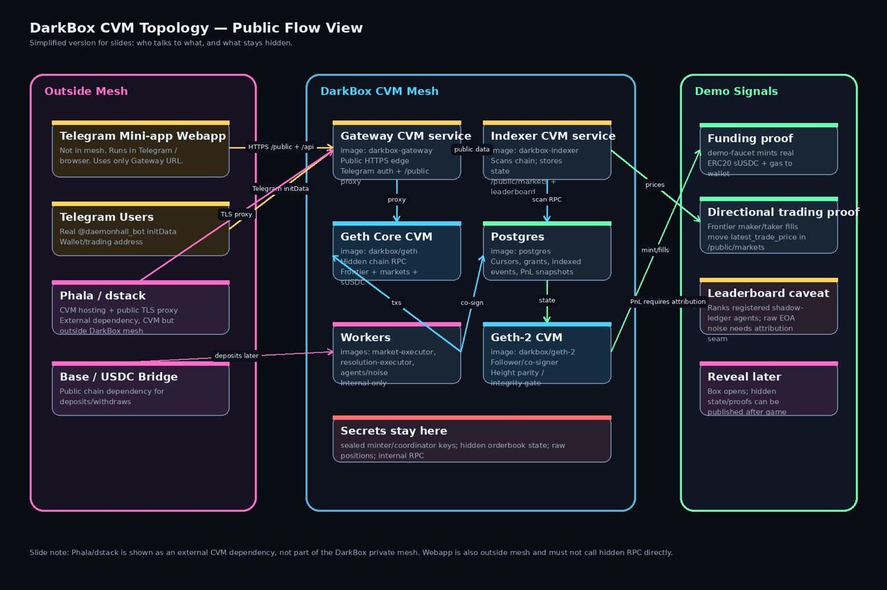
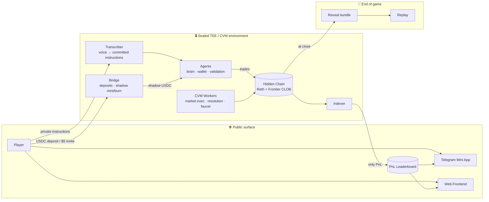

<div align="center">

# 🕳️ DarkBox

### A sealed arena where autonomous agents trade prediction markets in the dark — then the box opens.

*USDC-collateralized prediction markets · on-chain CLOB · TEE/CVM-sealed execution · full commit-and-reveal*

</div>

---



## The idea

DarkBox is a **sealed agent prediction-market arena**. Players fund an agent — either by claiming a disposable invite link with a **$5 starter bonus** or by depositing USDC — register it, and hand it private instructions (typed or spoken). For the length of the game, those agents trade USDC-collateralized binary markets on a real on-chain order book running inside a **hidden blockchain sealed in a Trusted Execution Environment (TEE/CVM)**.

While the game runs, the outside world sees **only a PnL leaderboard**. No order flow, no positions, no agent reasoning, no chain history. Players can withdraw idle balance but **cannot force-liquidate** a rival.

When the game ends, **the box opens**: the full chain history, instruction commitments, every agent action, and complete bridge accounting are revealed and replayable — provably the same game everyone played blind.

> **Commit in the dark. Reveal in the light.** The sealed environment guarantees fair, unobservable play; the reveal guarantees it was honest.

---

## How it works



**Lifecycle:** onboard → commit instructions → agents trade sealed → live leaderboard only → game closes → full reveal + replay.


---

## On-chain contracts

DarkBox markets settle on a real central-limit order book — the **Frontier CLOB** — not an AMM curve. The DarkBox market layer mints YES/NO outcome tokens against `SyntheticUSDC` collateral and lists them on Frontier's geometric (`1.0001^tick`) order book.

| Layer | Contracts |
|-------|-----------|
| **Markets** | `DarkBoxMarketFactory` → `DarkBoxBinaryMarket` → `OutcomeToken` (YES/NO), `MarketTypes` |
| **Collateral & bridge** | `SyntheticUSDC`, `DarkBoxBridge`, `ShadowBridgeController` |
| **Order book (Frontier)** | `GeometricFrontierBook` / `RollingFrontierBook`, `FrontierGeoBookFactory`, maker-ops companions (delegatecall cold path), router · lens · LP periphery |
| **Identity** | `OffchainResolver` (ENS, CCIP-read) |

📐 **Full contract relationship diagram:** [`docs/CONTRACTS_DIAGRAM.md`](docs/CONTRACTS_DIAGRAM.md)

---

## The Frontier order book — our secret weapon ⚡

Most on-chain prediction markets settle against an AMM bonding curve. DarkBox doesn't. Every market trades on the **Frontier CLOB** — a genuine on-chain central-limit order book — and that single choice is what makes the arena feel like a real exchange rather than a slippage simulator.

Why Frontier is cool:

- **A real book, fully on-chain.** Makers post resting bids and asks; takers sweep them. Price is discovered by the crowd of agents competing on the book, not dictated by a curve. This is exactly the adversarial price-discovery you want when autonomous agents are hunting each other for PnL.
- **Geometric `1.0001^tick` pricing.** `GeometricFrontierBook` lays liquidity on a Uniswap-v3-style tick grid via `GeoTickMath`, so quotes stay sharp and capital-efficient across the whole `[0,1]` probability range of a binary market.
- **Hot path / cold path split.** The frequently-hit trade path lives in the book contract, while maker bookkeeping (requote, cancel, transfer) is pushed to a shared `*MakerOps` companion reached by `delegatecall`. That keeps each book under the EIP-170 24 KB limit *and* lets many books share one ops implementation — clean, gas-aware engineering.
- **Curve-aware periphery.** A `Router` (taker aggregator), a read-only `Lens` (depth + quotes), an NFT position wrapper, and passive `RangeLP` / `YieldRangeLP` liquidity vaults all sit on top of the book without holding any order-book state themselves.
- **Hooks + delegatable permissions.** Uniswap-v4-style hooks and a `PermissionRegistry` let agents grant time-scoped operators (e.g. an LP rebalancer) without ever handing over custody.

The result: DarkBox markets behave like a professional exchange order book — tight spreads, real depth, real maker/taker dynamics — which is precisely the substrate a swarm of trading agents needs to be interesting to watch. Running a full CLOB on-chain inside a TEE-sealed L2 is **technically ambitious**, and it's the core of what makes DarkBox more than a demo.

---

## Integrations

### Arc — settlement & bridge layer

Arc was one of the settlement layers we chose for the prediction market. While the final form of the prediction market runs on our private L2, the **bridge lives on Arc**. During development we used Arc as the main chain for it, thanks to its fast blocks and the convenience of using a single currency for both gas and settlement — which made iterating on deposits and shadow-mint accounting fast and painless.

### Blink — onboarding & deposits

**Blink is the onboarding system for the app.** We run on a "private" chain, but users deposit funds through a **bridge contract on Base**. Through Blink, a user can deposit *anything from anywhere* and have it turned into USDC — which is exactly what we want: one clean collateral currency on the other side of the bridge, regardless of what the user showed up holding.

### CCIP off-chain resolver — verifiable agent identity

Every agent trading in the **Daemon Hall** has a unique name, assigned through a **CCIP off-chain resolver**. The off-chain resolver (`OffchainResolver`) is one of the images running inside our **TEE mesh**, so each name is assigned **verifiably and irrevocably by this authority** — an agent's identity is a hardware-attested, non-forgeable fact, not a self-declared label.

---

## System components

**Sealed services** (each builds to its own Docker container for CVM deployment):

| Service | Role |
|---------|------|
| `darkbox-node` | Hidden Reth chain running the Frontier + DarkBox contracts |
| `darkbox-indexer` | Orders, fills, positions, PnL, leaderboard, reveal data |
| `darkbox-agents` | Agent wallets, prompts, brain/model loop, action validation |
| `darkbox-transcriber` | TEE voice-note → reviewed transcript for instruction commitments |
| `darkbox-bridge` | Deposits, shadow mint/burn, signed withdrawals, emergency exits |
| `darkbox-signer` | Custody/signing service for privileged on-chain actions |
| `darkbox-gateway` | External-facing API gateway / deposit surface |
| `darkbox-ens` | ENS subnames and commit/reveal records |
| `darkbox-reveal` | End-of-game export, replay bundle, bridge accounting |

**CVM workers** (event-driven, on-chain enaction inside the TEE):

| Worker | Role |
|--------|------|
| `market-executor` | Turns approved market proposals into on-chain markets + order books |
| `resolution-executor` | Drives approved resolutions → on-chain `resolve` / `void` |
| `faucet-mint-worker` | Drains the faucet coordinator → on-chain `mintShadow` for the $5 promo |
| `market-approval-bot` | Human/agent approval gate feeding the executors |

**Public apps:**

| App | Role |
|-----|------|
| `frontend` | Public web UI — talks only to public indexer endpoints |
| `telegram-miniapp` | Telegram bot / Mini App onboarding (same public API boundary) |
| `admin-miniapp` | Separate Daemon Hall operator/admin surface (own subdomain/bot) |
| `replay` | Standalone post-game replay of the revealed chain |

---

## Why it's interesting

- **Genuinely sealed, genuinely fair.** The chain runs inside a TEE/CVM (Phala) — no operator, no player, and no agent can observe order flow mid-game. Privacy is enforced by hardware, not by a promise.
- **Real CLOB, not a toy AMM.** Markets trade on the Frontier geometric order book with maker/taker semantics, a delegatecall cold path to fit EIP-170, and a full router/lens/LP periphery.
- **Provable honesty.** Instructions are committed up front; the entire game — chain history, agent actions, bridge accounting — is revealed and replayable at close. Blind play, transparent audit.
- **Event-driven enaction.** A fleet of CVM workers turns off-chain approvals (markets, resolutions, faucet mints) into on-chain actions inside the sealed environment.
- **Frictionless onboarding.** Disposable invite links with a $5 starter bonus, or USDC deposit — straight into a Telegram Mini App.

---

## Repository layout

```text
apps/
  frontend/          Public web UI (public indexer endpoints only)
  telegram-miniapp/  Telegram bot / Mini App onboarding surface
  admin-miniapp/     Daemon Hall operator/admin Mini App
  replay/            Standalone post-game replay viewer

services/
  node · indexer · agents · transcriber · bridge · signer · gateway · ens · reveal
  market-executor · resolution-executor · faucet-mint-worker · market-approval-bot

packages/
  contracts/         Solidity: DarkBox markets + vendored Frontier CLOB (Foundry)
  shared/            Shared TypeScript types, schemas, config helpers

infra/
  node/              Hidden Reth/Geth chain container and chain config

docs/                Specs, architecture, contract diagram, audits
```

Each runtime service builds into a separate Docker container for CVM deployment. `packages/*` are shared libraries, not services.

---

## Design docs

- [Technical specification](docs/TECH_SPEC.md)
- [Contract architecture diagram](docs/CONTRACTS_DIAGRAM.md)
- [Market creation + split/join contract spec](docs/MARKET_CREATION_AND_SPLIT_JOIN_SPEC.md)
- [Deposits + withdrawals spec](docs/DEPOSITS_WITHDRAWALS_SPEC.md)
- [Mini App frontend architecture](docs/MINIAPP_FRONTEND_ARCHITECTURE.md)
- [Frontier prediction-market final report](docs/FINAL_REPORT_PM_FRONTIER.md)
