# Contract Architecture

Mermaid diagram of all production smart contracts in `packages/contracts/`, covering the
DarkBox core (markets, bridge, tokens) and the vendored Frontier orderbook engine.

Mock/test contracts (`MockERC20`, `MockYieldVault`) are intentionally excluded.

```mermaid
graph TD
    %% ============ DARKBOX CORE ============
    subgraph DarkBox["DarkBox Core (packages/contracts/src)"]
        Factory[DarkBoxMarketFactory]
        Market[DarkBoxBinaryMarket]
        OutYes[OutcomeToken · YES]
        OutNo[OutcomeToken · NO]
        sUSDC[SyntheticUSDC]
        Bridge[DarkBoxBridge]
        Shadow[ShadowBridgeController]
        Resolver[OffchainResolver · ENS/CCIP]
        Types[[MarketTypes · lib]]
    end

    subgraph DBInterfaces["DarkBox Interfaces"]
        IBridge([IDarkBoxBridge])
        IShadow([IShadowBridgeController])
        IFront([IFrontier · IFrontierGeoBookFactory])
    end

    %% DarkBox edges
    Factory -->|deploys| Market
    Factory -->|lifecycle calls: pause/resume/close/resolve/void| Market
    Factory -->|holds collateral addr| sUSDC
    Factory -->|createGeoBookWithFees| IFront
    Market -->|deploys| OutYes
    Market -->|deploys| OutNo
    Market -->|collateral| sUSDC
    Market -->|mint/burn| OutYes
    Market -->|mint/burn| OutNo
    OutYes -.->|owner = market| Market
    OutNo -.->|owner = market| Market
    Bridge -. implements .-> IBridge
    Bridge -->|escrow token| sUSDC
    Shadow -. implements .-> IShadow
    Factory -. uses .-> Types
    Market -. uses .-> Types

    %% Bridge between DarkBox and Frontier
    IFront -. resolves to .-> GeoFactory

    %% ============ FRONTIER ORDERBOOK ============
    subgraph Frontier["Frontier Orderbook (packages/contracts/lib/frontier)"]

        subgraph Books["Order Books"]
            Rolling[RollingFrontierBook]
            Uniform[UniformFrontierBook]
            Geo[GeometricFrontierBook]
            RangeTP[RangeTakeProfitBook]
            Reference[ReferenceBook · correctness oracle]
        end

        subgraph Base["Base / Curve"]
            BookBase[[FrontierBookBase · abstract]]
            GeoCurve[[GeometricCurve · mixin]]
            GeoMath[[GeoTickMath · lib]]
        end

        subgraph Ops["Maker Ops · delegatecall cold path"]
            FMOps[FrontierMakerOps]
            UMOps[UniformMakerOps]
            GMOps[GeometricMakerOps]
        end

        subgraph Factories["Factories + Deployers"]
            BookFactory[FrontierBookFactory]
            GeoFactory[FrontierGeoBookFactory]
            Deployers[FrontierDeployers · Rolling/Geo/Ops]
        end

        subgraph Periphery["Periphery"]
            Router[FrontierRouter]
            Lens[FrontierLens]
            MakerKit[FrontierMakerKit]
            PosNFT[FrontierPositionNFT]
            RangeLP[RangeLP]
            YieldLP[YieldRangeLP]
        end

        subgraph Infra["Permissions / Hooks"]
            PermReg[PermissionRegistry]
            IPerm([IPermissionRegistry])
            IHooks([IFrontierHooks])
            IBook([IRangeOrderBook])
        end
    end

    %% Inheritance
    Rolling -. inherits .-> BookBase
    Uniform -. inherits .-> BookBase
    Geo -. inherits .-> Uniform
    Geo -. inherits .-> GeoCurve
    GeoCurve -. inherits .-> BookBase
    FMOps -. inherits .-> BookBase
    UMOps -. inherits .-> BookBase
    GMOps -. inherits .-> UMOps
    GMOps -. inherits .-> GeoCurve
    GeoCurve -. uses .-> GeoMath

    Rolling -. implements .-> IBook
    Uniform -. implements .-> IBook
    RangeTP -. implements .-> IBook
    Reference -. implements .-> IBook

    %% Delegatecall
    Rolling -->|delegatecall| FMOps
    Uniform -->|delegatecall| UMOps
    Geo -->|delegatecall| GMOps

    %% Factories deploy books/ops
    BookFactory -->|deploys| Rolling
    BookFactory -->|deploys| Uniform
    BookFactory -->|deploys| FMOps
    BookFactory -->|deploys| GMOps
    GeoFactory -->|deploys| Geo
    GeoFactory -->|deploys| GMOps
    BookFactory --> Deployers
    GeoFactory --> Deployers
    BookFactory -->|shared| PermReg
    GeoFactory -->|shared| PermReg

    %% Permissions / hooks wired into base
    BookBase -->|auth| IPerm
    BookBase -->|callbacks| IHooks
    PermReg -. implements .-> IPerm

    %% Periphery -> books
    Router -->|buy/sell| Rolling
    Router --> Lens
    Lens -->|reads ledgers| BookBase
    Lens -. uses .-> GeoMath
    MakerKit -->|deposit/transfer| Rolling
    PosNFT -->|wraps positions| Rolling
    RangeLP -->|deposit/requote| Rolling
    YieldLP -->|deposit/requote| Rolling
    RangeLP --> PermReg
    YieldLP --> PermReg
```

## Notes

- **DarkBox core** — `DarkBoxMarketFactory` is the hub: it deploys each
  `DarkBoxBinaryMarket`, drives its lifecycle, and on creation calls the Frontier
  orderbook (`createGeoBookWithFees`) so a market's YES/NO `OutcomeToken`s become
  tradeable. Each market deploys its own outcome-token pair and uses `SyntheticUSDC`
  as collateral. `DarkBoxBridge` / `ShadowBridgeController` (deposit/escrow) and
  `OffchainResolver` (ENS) are standalone.
- **Frontier orderbook** — Two production book families: `RollingFrontierBook`
  (linear) and `GeometricFrontierBook` (1.0001^tick, production curve). Both inherit
  `FrontierBookBase` and push the cold path (requote/cancel/transfer) to a shared
  `*MakerOps` companion via `delegatecall` to stay under EIP-170. Factories deploy
  books + ops via helper deployers and memoize per token-pair config;
  `FrontierGeoBookFactory` is the production factory DarkBox calls into.
- **The link between the two systems** is the dashed `IFrontier → FrontierGeoBookFactory`
  edge — where DarkBox markets list their outcome tokens on the orderbook.
